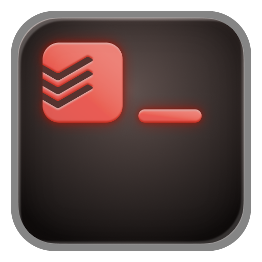

<p align="center">
  
</p>

# Todoist CLI

A command-line interface for Todoist.

## Installation

> ```bash
> npm install -g @doist/todoist-cli
> ```

### Agent Skills

Install skills for your coding agent:

```bash
td skill install claude-code
td skill install codex
td skill install cursor
td skill install gemini
td skill install pi
td skill install universal
```

Skills are installed to `~/<agent-dir>/skills/todoist-cli/SKILL.md` (e.g. `~/.claude/` for claude-code, `~/.agents/` for universal, etc.). When updating the CLI, installed skills are updated automatically. The `universal` agent is compatible with Amp, OpenCode, and other agents that read from `~/.agents/`.

```bash
td skill list
td skill uninstall <agent>
```

## Uninstallation

First, remove any installed agent skills:

```bash
td skill uninstall <agent>
```

Then uninstall the CLI:

```bash
npm uninstall -g @doist/todoist-cli
```

## Local Setup

```bash
git clone https://github.com/Doist/todoist-cli.git
cd todoist-cli
npm install
npm run build
npm link
```

This makes the `td` command available globally.

## Setup

```bash
td auth login
```

This opens your browser to authenticate with Todoist. Once approved, the token is stored in your OS credential manager:

- macOS: Keychain
- Windows: Credential Manager
- Linux: Secret Service/libsecret

If secure storage is unavailable, the CLI warns and falls back to `~/.config/todoist-cli/config.json`. Existing plaintext tokens are migrated automatically the next time the CLI reads them successfully from the config file.

### Alternative methods

**Manual token:** Get your API token from [Todoist Settings > Integrations > Developer](https://todoist.com/app/settings/integrations/developer):

```bash
td auth token "your-token"
```

**Environment variable:**

```bash
export TODOIST_API_TOKEN="your-token"
```

`TODOIST_API_TOKEN` always takes priority over the stored token.

### Auth commands

```bash
td auth status   # check if authenticated
td auth logout   # remove saved token
```

## Usage

```bash
td add "Buy milk tomorrow #Shopping"   # quick add with natural language
td today                               # tasks due today + overdue
td inbox                               # inbox tasks
td task list                           # all tasks
td task list --project "Work"          # tasks in project
td project list                        # all projects
td task view https://app.todoist.com/app/task/buy-milk-8Jx4mVr72kPn3QwB  # paste a URL
```

Run `td --help` or `td <command> --help` for more options.

## Accessibility

For users who rely on screen readers or cannot distinguish colors, use the `--accessible` flag or set `TD_ACCESSIBLE=1` to add text labels to color-coded output:

```bash
td today --accessible
# or
export TD_ACCESSIBLE=1
td today
```

When active, due dates get a `due:` prefix, deadlines get a `deadline:` prefix, durations get a `~` prefix, and favorite items get a `★` suffix. Default output without the flag is unchanged.

## Shell Completions

Tab completion is available for bash, zsh, and fish:

```bash
td completion install        # prompts for shell
td completion install bash   # or: zsh, fish
```

Restart your shell or source your config file to activate. To remove:

```bash
td completion uninstall
```

## Development

```bash
npm install
npm run build       # compile
npm run dev         # watch mode
npm run type-check  # type check
npm run format      # format code
npm test            # run tests
```
